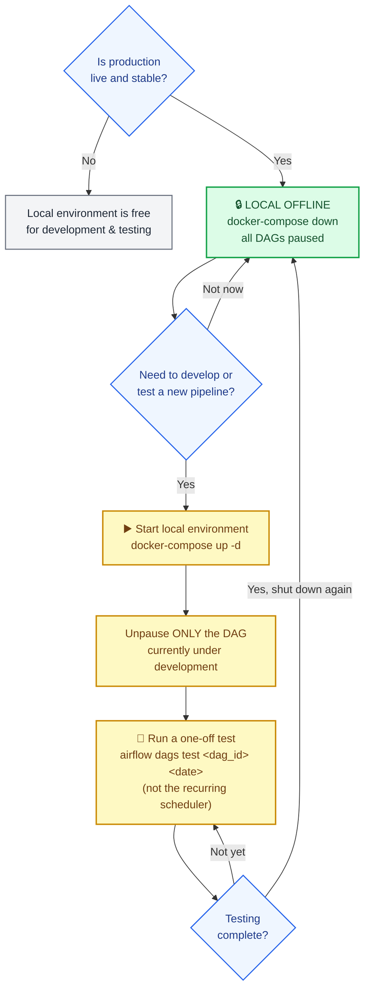
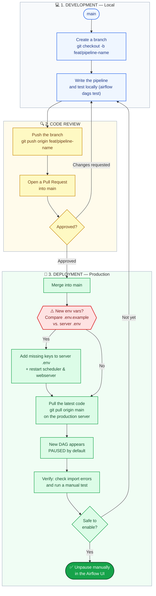

# Work Flow Tim Data (setelah production live)

Dokumen ini buat tim data (bukan devops) — cara aman nambah/ubah pipeline setelah
stack ini live di production. Untuk cara deploy/operate infra, lihat
[`docs/DEPLOYMENT.md`](DEPLOYMENT.md). Untuk konvensi kode, lihat
[`../CLAUDE.md`](../CLAUDE.md).

## 1. Local vs Production — TIDAK ada environment terpisah



⚠️ **Penting**: `config/config_db_*.py` di instance Airflow **manapun** (local kamu,
production) selalu nunjuk ke database production yang sama
(`dblake.jiwa.prod`, `db-ksj.jiwa.prod`, `db.jiwa.prod`), dan API eksternal yang
dipanggil (iSeller, landlord Lippo Mall, OSRM) juga API production sungguhan — **tidak
ada sandbox/staging**.

Konsekuensinya: **local Airflow dan production Airflow tidak boleh sama-sama jalan
dengan scheduler aktif + DAG unpaused di saat yang bersamaan.** Kalau dua-duanya jalan,
DAG yang sama bakal ke-trigger 2x di jadwal yang sama, nulis ke DB yang sama, dan
(paling bahaya) **kirim data 2x ke API eksternal** (mis. duplicate revenue record di
sistem landlord) serta ngirim email report 2x ke tim.

**Aturan main:**

- Begitu production sudah live & stabil, **stop/pause local Airflow kamu**:
  ```bash
  docker-compose down          # di folder repository lokal
  ```
  atau minimal pause semua DAG dari UI local.
- Kalau mau develop/test pipeline baru lagi, nyalain local sebentar
  (`docker-compose up -d`), tapi **cuma unpause DAG yang lagi kamu kerjain**, sisanya
  biarin paused.
- Untuk test, pakai one-off run — **bukan** nunggu scheduler trigger otomatis:
  ```bash
  docker-compose exec airflow-scheduler airflow dags test <dag_id> $(date +%Y-%m-%d)
  ```
  Ini jalan sekali secara sinkron, tidak menambah jadwal berulang.
- Selesai testing, `docker-compose down` lagi di local sebelum ditinggal.

## 2. Git branch flow — jangan pernah push langsung ke `main`



`main` adalah representasi "apa yang boleh
di-deploy ke production". Alurnya (GitHub Flow, bukan Gitflow — nggak perlu branch
`develop`/`release` buat tim & scale sekarang):

```bash
git checkout main
git pull                                    # pastikan main lokal up to date
git checkout -b feat/nama-pipeline-baru      # branch baru, BUKAN main
# ... coding, test lokal (airflow dags test) ...
git add .
git commit -m "..."
git push -u origin feat/nama-pipeline-baru
```

Lalu buka **Pull Request** di GitHub: branch kamu → `main`. Setelah di-review
(self-review kalau solo, atau teman satu tim) dan **di-merge**, barulah `main`
ter-update. Server production baru `git pull origin main` **setelah** merge itu — bukan
langsung dari branch kamu, dan bukan push langsung ke `main`.

Kenapa lewat PR, bukan langsung ke `main`:
- Titik terakhir buat nangkep kesalahan sebelum nyentuh production (secret ke-commit,
  query salah outlet/tanggal, dst).
- History `main` jadi jelas mana yang "sudah direview" — gampang di-rollback ke commit
  `main` sebelumnya kalau ada masalah (lihat `docs/DEPLOYMENT.md` bagian 11).

Disarankan aktifkan **branch protection** di GitHub untuk `main` ("require pull request
before merging") supaya nggak ada yang (termasuk diri sendiri kepencet) push langsung.

**Siapa yang `git pull` di server production** — tergantung kesepakatan dengan tim devops saat handover, apabila tim data memiliki SSH maka bisa dilakukan oleh tim data sendiri.

## 3. Checklist nambah pipeline baru

1. Branch baru dari `main` (lihat bagian 2).
2. Ikuti struktur `extract.py` / `transform.py` / `load.py` / `etl_orchestrator.py` —
   lihat [`../CLAUDE.md`](../CLAUDE.md) bagian **"1. Arsitektur DAG & Pipeline"**
   (struktur file, config loading, 1-task DAG, date window, idempotensi,
   notifikasi, logging — baca semua sub-bagiannya, bukan cuma sepintas).
3. Tabel target: **kamu yang bikin manual di DBeaver duluan** — pipeline tidak pernah
   `CREATE TABLE` (lihat [`../CLAUDE.md`](../CLAUDE.md) bagian **"3.2 Provisioning
   tabel database"**).
4. Tag `load_data_by`/`updated_by` = `'NEXUS_AIRFLOW'` (bukan email personal).
5. Butuh secret baru (API key, password, dst)? Tambahkan key-nya ke `.env.example`
   (placeholder kosong, aman di-commit) — nilai aslinya kamu serahkan ke devops di luar
   git saat deploy (lihat `docs/DEPLOYMENT.md` bagian 3).
6. Test lokal: `airflow dags test <dag_id> <tanggal>`, cek `airflow dags
   list-import-errors`.
7. Tulis dokumentasinya: `docs/pipelines/<nama_dag>.md` (contoh struktur: lihat DAG lain
   di folder yang sama) + tambahkan 1 baris ke tabel index
   [`docs/pipelines/README.md`](pipelines/README.md).
8. Push branch, buka PR ke `main`, review, merge.
9. **Sebelum deploy — verifikasi `.env` di server production sudah sinkron:**
   bandingkan key di `.env.example` (yang baru saja kamu update di langkah 5) dengan
   isi `.env` yang sungguhan ada di server. `.env` **tidak pernah ikut `git pull`**
   (gitignored) — jadi key baru yang kamu tambahkan ke `.env.example` TIDAK otomatis
   muncul di server, harus ditambahkan manual ke `.env` server + restart
   (`docker-compose restart airflow-scheduler airflow-webserver`). Lewatin langkah ini
   = DAG baru bakal gagal jalan pertama kali dengan error "Missing ... in .env" (pernah
   kejadian beneran, 2026-09-23, pada `api_landlord_revenue_sharing_01065` setelah
   migrasi credential ke env — root cause-nya persis ini).
10. Deploy: `git pull` di server (lihat `docs/DEPLOYMENT.md` bagian 7). DAG baru otomatis
    **paused** saat pertama muncul (`AIRFLOW__CORE__DAGS_ARE_PAUSED_AT_CREATION`) — cek
    dulu (`list-import-errors`, trigger manual test run) sebelum unpause manual di UI.
